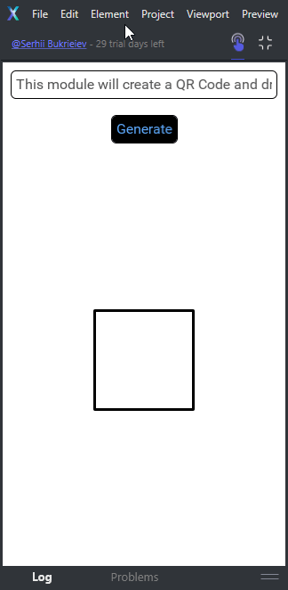

# Fuse.QrcodeGenerator
Generate QR Code from Fuse App



# Usage
Add this repos to your Fuse project
```
fusepm install https://github.com/Anagrr/Fuse.QrcodeGenerator
```
Update your project .uno file
```uno
 "Projects": [
    "fuse_modules/Anagrr/Fuse.QrcodeGenerator/Fuse.QrcodeGenerator/Fuse.QrcodeGenerator.unoproj"
  ],
  "Excludes": [
    "fuse_modules/"
  ],
  "FusePM": {
    "Dependencies": [
      "https://github.com/Anagrr/Fuse.QrcodeGenerator"
    ]
  }
 ```
 update some path of internal libs
 ```javascript
 import QrCodeGenerator from './Generator/QrCodeGenerator';
 import QrCodeElement from './Generator/QrCodeElement';
 ```
 Now you can easily add the model insight your UX root code
 ```ux
 <Panel ux:Class="example.hello" Model="MainView">
 ```
 And the last pice of cake, add this tag to generate QR Code inside the view
 ```ux
 <QrCodeDisplay Dock="Top" Alignment="Center"/>
 ```
 # Parameters
 The only required parameter is inside the Model file (MainView.js), you can customize it
 inside the MainView class contructor. Just change the content of variable this.text (as you want)
 ```javascript
 constructor() {
        this.text = "https://fuseopen.com/docs/scripting/debugging.html https://fuseopen.com/docs/scripting/debugging.html https://fuseopen.com/docs/scripting/debugging.html";
        this.elements = [];
        this.gridSize = 0;
        this.gridCellsize = 0;
        this.isDark = true;
    }
 ```
 # Author
 Thank to [Serhii Bukrieiev](https://github.com/Anagrr/) for this awesome projet that save my life. 
 
 Have fun !
