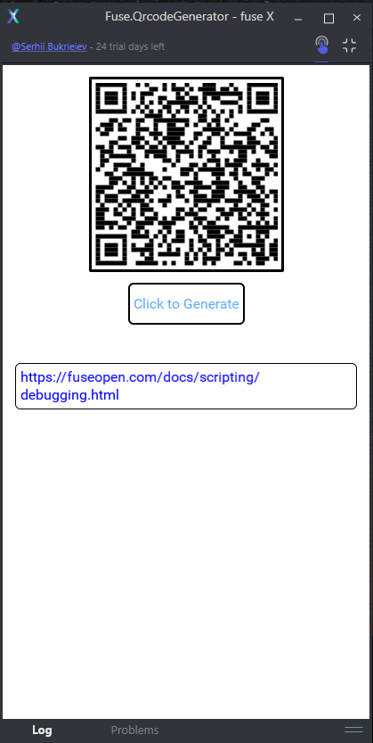

# Fuse.QrcodeGenerator
Generate QR Code from Fuse App



# Usage
Add this repos to your Fuse project
```
fusepm install https://github.com/Anagrr/Fuse.QrcodeGenerator
```
Update your project .uno file
```uno
 "Projects": [
    "fuse_modules/Anagrr/Fuse.QrcodeGenerator/Fuse.QrcodeGenerator/Fuse.QrcodeGenerator.unoproj"
  ],
  "Excludes": [
    "fuse_modules/"
  ],
  "FusePM": {
    "Dependencies": [
      "https://github.com/Anagrr/Fuse.QrcodeGenerator"
    ]
  }
 ```
 To use QrCode genetaor just add the renderer with binding and place where you want to see a QR code
 ```ux
 <QrCodeRenderer Alignment="Center" Text="{text}"/>
 ```
 Binding should be in a parent. The size of the QR code will be calculated automatically.

 # Author
 Thank to [Serhii Bukrieiev](https://github.com/Anagrr/) for this awesome projet that save my life. 
 
 Have fun !
